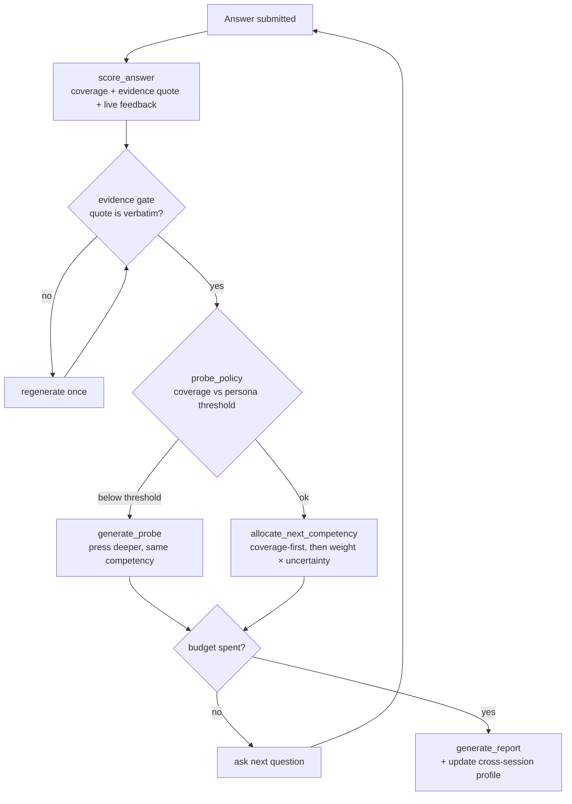

# callback-ai

### ▶︎ [Live demo — callback-ai.onrender.com](https://callback-ai.onrender.com)

[](https://github.com/Zeref538/callback-ai/actions/workflows/ci.yml)
[](https://callback-ai.onrender.com)
&nbsp;·&nbsp; 90 tests ·&nbsp; Python 3.11+ ·&nbsp; FastAPI

> The live demo runs on Render's free tier, so the **first request after idle
> takes ~50s to wake up** — give it a moment, then it's fast.

**An adaptive, agentic interview simulator.** Most prep tools read from a
question list. This one runs an agent that decides what to ask *you* next based
on how you just answered — then grades every claim against your own words.

> Say *"I improved performance"* and the next question is *by how much, and how
> did you measure it?* That follow-up is where real interviews are won or lost,
> so it's where this one lives.

Named for the callback you're trying to earn, the debrief speaks in that
language too — *"you'd get the callback"* / *"close call"* / *"not yet"* — not a
bare `0.62`.

---

## What makes it different

| | |
|---|---|
| **It probes.** | Vague answers get pressed on the *same* competency until they're specific — the agent chooses to follow up, it isn't scripted to. |
| **It budgets.** | 12 questions, reallocated after every answer toward the competencies it's least sure about (weight × uncertainty), not spread evenly. |
| **It cites.** | Every score must quote your transcript *verbatim*. A score whose quote can't be found is rejected and regenerated — never shown. |
| **It remembers.** | Weak competencies persist across sessions; the next run biases its budget toward them and the debrief shows your **delta since last time**. |
| **It talks.** | Each interviewer has a distinct **neural voice** (free, no key) and reads questions aloud; you can answer back **by voice** with a live mic meter. |

Three interviewers, each with their own manner and voice — **Nova** (friendly ·
engineering manager), **Ellis** (neutral · senior engineer), **Kade** (strict ·
principal engineer). Persona changes how hard you're *pushed*, never how you're
*graded* — scoring stays persona-invariant on purpose.

**Inputs:** paste or upload the job post + your résumé (PDF / DOCX / TXT / MD,
OCR-free extraction) and drop a portfolio URL (best-effort scrape). Pick a
target level (junior / mid / senior) that tunes how hard the agent probes.

**The debrief:** an overall readiness ring, a **competency radar**, per-area
scores each with the verbatim quote that earned them, a stronger answer written
in *your* voice from *your* real claims, a progress delta vs. your last attempt,
and one-click **Download PDF**.

---

## Why it's an *agent*, not a pipeline

`session_engine.py` is a state-driven loop, not a fixed sequence. Each turn it
re-reads the session state — remaining budget, per-competency uncertainty, the
last answer — and **decides** the next tool to call:



The branching — *whether* to probe, *which* competency next, *when* to switch to
the report, *whether* to scrape a portfolio at all — is the agent's decision.
The guardrails that must **never** be left to model discretion are enforced in
code around those calls: the evidence gate's verbatim-quote check, the fixed
budget ceiling, and persona-invariant scoring.

---

## Measured quality (live NVIDIA NIM · Llama 3.1)

Real numbers from `eval/`, run against a live model — not aspirational:

| Metric | What it checks | Target | **Result** |
|---|---|---|---|
| **Discrimination** | Spearman ρ between the agent's ranking and a human ranking of 10 graded answers | ρ ≥ 0.8 | **0.81 ✅** |
| **Grading consistency** | Same transcript re-graded 5× (temperature 0) | ≤ 1.0 pt / 10 | **0.0 ✅** |
| **Probe precision** | Fires on vague answers, stays quiet on specific ones | ≥ 0.8 / ≤ 0.1 | **1.0 / 0.0 ✅** |
| **Evidence-gate rejection** | Share of scores rejected for an unquotable claim | reported honestly | logged per session (`session_end`) |
| **Budget adaptivity** | Question share vs. a uniform baseline | measurably non-uniform | pulled from session logs |

Reproduce: `python -m eval.discrimination`, `python -m eval.grading_consistency`,
`python -m eval.probe_precision` (need `NIM_API_KEY`). Every eval script is also
unit-tested against a fake provider so the logic is verified without a key.

---

## Quick start

```bash
python -m venv .venv
.venv/Scripts/pip install -e ".[dev]"     # Windows; use .venv/bin/pip elsewhere
cp .env.example .env
```

**No API key? Run the whole app offline.** The mock provider answers every
prompt type with keyword heuristics:

```bash
CALLBACK_AI_PROVIDER=mock .venv/Scripts/python -m callback_ai.server
```

**For real,** get a free key at [build.nvidia.com](https://build.nvidia.com)
(pick a model → *Get API Key*), put it in `.env` as `NIM_API_KEY`, keep
`CALLBACK_AI_PROVIDER=nim`, then:

```bash
.venv/Scripts/python -m callback_ai.server
```

Open <http://localhost:8000>. Check wiring at `/api/health`. Voice needs no
extra setup — neural TTS uses free Microsoft voices via `edge-tts`; voice
answers use the browser's Web Speech API (Chrome/Edge).

CLI instead of the browser:

```bash
.venv/Scripts/python -m callback_ai.cli.main \
  --job-post eval/fixtures/job_posts/01_backend_engineer.txt \
  --resume   eval/fixtures/resumes/sample_resume.txt \
  --persona  adversarial
```

**Tests:** `.venv/Scripts/python -m pytest` — **87 tests**, all against fake/mock
providers, so no key is needed to verify the logic.

---

## Architecture

```
ingest/     job post + résumé + portfolio link -> one merged claim inventory
            (conflicting claims are flagged, not silently resolved); OCR-free
            document extraction; best-effort portfolio scrape
interview/  the agent loop, budget allocator, probe policy, personas, evidence gate
grading/    the debrief + model answers constrained to your real claims
memory/     JSONL session logs + cross-session weak-competency profile + delta
llm/        NIM provider, Ollama fallback, offline mock, tolerant JSON parsing
api/, web/  FastAPI backend (rate-limited, input-validated) + one static page
eval/       the five metrics above
```

The three ingest parses (job post / résumé / portfolio) run in parallel, so
setup costs one call's latency, not three. The frontend is a single static page
— plain hand-written CSS, no build step, no runtime framework.

## Deploy

**One click:** the repo ships a [`render.yaml`](render.yaml) blueprint — in
Render, *New → Blueprint → this repo*, then set `NIM_API_KEY` in the dashboard
(it's `sync:false`, never committed). Health-checks `/api/health` automatically.

**Any host** that runs a Python web process (Render, Railway, Fly, a VM). The
`Procfile` runs `callback-ai-serve`, which binds `0.0.0.0` and honours `$PORT`.

1. Build: `pip install -e .`
2. Start: `callback-ai-serve` (or `python -m callback_ai.server`)
3. Env: `NIM_API_KEY` (+ `CALLBACK_AI_PROVIDER=nim`), or `CALLBACK_AI_PROVIDER=mock`
   for the keyless demo. Optional: `RATE_LIMIT_PER_MIN` (default 90).
4. Verify `/api/health`.

Keep `WEB_CONCURRENCY=1` (the default): sessions live in the server process, so
a second worker can't see a session the first one started. Raise it only after
moving sessions to shared storage.

## Production hardening

- **Input validation** at every boundary — job-post length, persona, budget
  clamp `[1,30]`, empty/oversized uploads, empty answers, empty rubrics.
- **Bounded memory** — sessions evict FIFO past a cap; the per-IP rate limiter
  self-prunes idle clients.
- **Graceful degradation** — TTS falls back to Web Speech; a JS-only portfolio
  falls back to résumé + role; the app runs fully on the mock with no key.
- **Readable errors** — provider/auth/malformed-JSON failures surface as clean
  502s, not tracebacks.

## Known limits

- Sessions live in the server process — a restart drops any in-flight interview
  (the UI warns before you leave). Fine for a single-user demo; needs shared
  storage (Redis) for concurrency and resumable sessions.
- Cross-session memory and the rubric cache are local files — they reset on an
  ephemeral PaaS redeploy.
- Portfolio parsing is best-effort HTML; JS-rendered sites won't parse.
- Scanned/image-only PDFs are detected and reported (true OCR needs a system
  Tesseract install, deliberately not bundled).

See [PRD.md](PRD.md) for the full spec.
